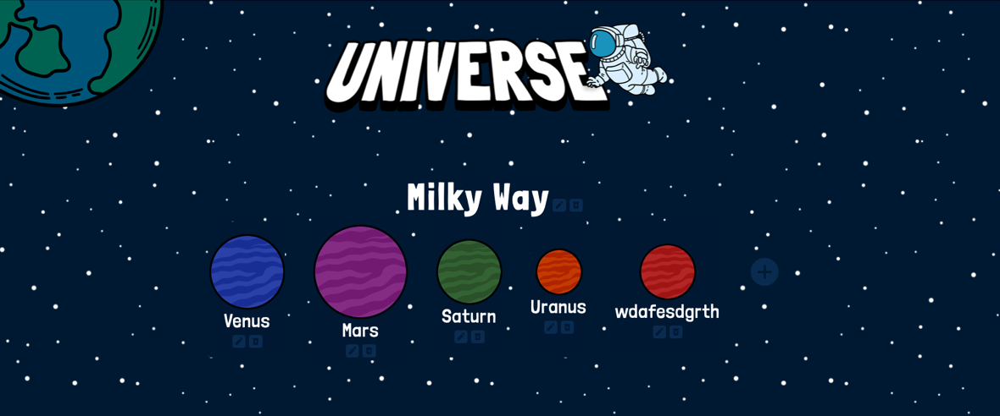

# Promineo Week-15: React + CRUD

### Create/Edit/Remove galaxies and planets in this "Universe"

### Assignment Instructions

- Using the Houses API, or any open API of your choice you can find online, create a single page that allows for all 4 CRUD operations to be performed on a resource from the API.
- Create a React component (or more, if needed) to represent the resource.
- Make all forms and other necessary UI pieces their own components as reasonable.
